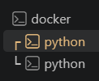
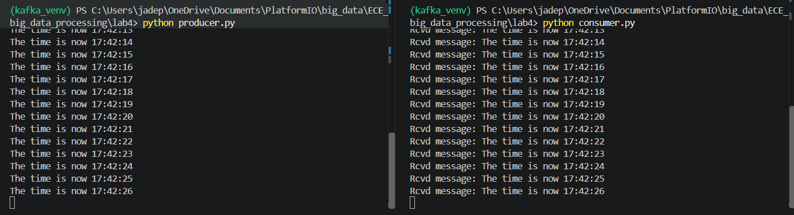

# Create venv & install requirements

Create venv
```
python -m venv kafka_ven
```

Activate venv
```
.\kafka_venv\Scripts\activate
```

Install dependecies
```
pip install -r .\requirements.txt
```

# First Terminal (outside the venv)

```
# Get the Docker image
docker pull apache/kafka-native:4.1.1
# Start the Kafka Docker container
docker run -p 9092:9092 apache/kafka-native:4.1.1
```

# Second Terminal (inside the venv)

Test the admin python file
```
python admin.py
```

Run publisher
```
python producer.py
```

# Third Terminal (inside the venv)

Run consumer
```
python consumer.py
```

# Final result



